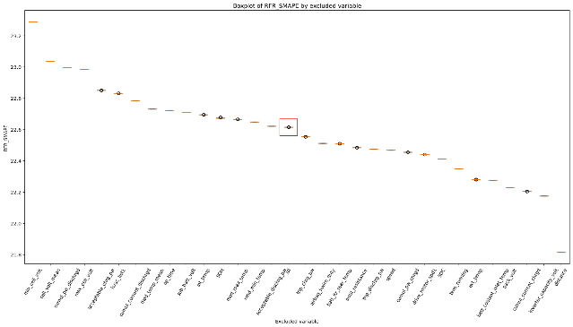
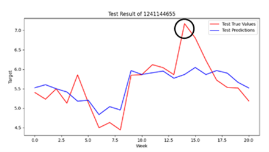

# Transformer-Based Energy Efficiency Prediction for Electric Vehicles

## Project Overview
This repository documents a research project conducted at **Handong Artificial Intelligence Lab (HAIL)** at **Handong Global University** in collaboration with **AiCAR**. The project focused on the application of a Transformer-based model, Pyraformer, to predict the energy efficiency of electric vehicle (EV) batteries, defined as the distance traveled per unit of State of Charge (SOC). The goal was to provide accurate predictions of battery performance to address range anxiety and improve battery management under real-world conditions. The project leveraged real-world driving data from 205 EVs and utilized a novel Pyramidal Attention Module (PAM) to model multi-scale temporal patterns effectively.

Due to the proprietary nature of the data and collaboration, specific datasets and detailed model configurations are not included. This README provides a high-level overview of the project’s objectives, methodology, and outcomes to showcase my contributions and technical expertise.

## Problem Statement
Energy efficiency in EV batteries degrades over time due to factors such as driving patterns, environmental conditions, battery aging, and accessory usage. Accurate prediction of energy efficiency is critical for:
- Estimating driving range to alleviate range anxiety.
- Optimizing battery management and vehicle performance.
- Providing actionable insights for EV users based on real-world conditions.

The challenge was to develop a model that captures both short-term fluctuations and long-term trends in energy efficiency while handling noisy, variable real-world data and ensuring computational efficiency and generalizability across different EV models.

## Methodology
The project utilized the Pyraformer model, a Transformer-based architecture with a Pyramidal Attention Module (PAM), to predict energy efficiency. Key aspects of the methodology include:

### 1. Model Structure
The model predicts energy efficiency, defined as distance traveled per unit of SOC, using a sequence-to-sequence (seq2seq) framework. The Pyraformer architecture:
- Employs a **Pyramidal Attention Module (PAM)** to capture multi-scale temporal dependencies, addressing both short-term fluctuations and long-term trends.
- Uses convolutional techniques to compress data across scales, reducing computational overhead compared to standard Transformer models.
- Incorporates positional encodings and a Coarser-Scale Construction Module (CSCM) to model sequence information effectively.

The model predicts energy efficiency three months ahead based on one month of historical data, with predictions refined using overlapping monthly windows.

### 2. Data Utilization
The model was trained and tested using real-world driving data from **205 electric vehicles** across four models (Ionic 5 Long Range, Kona EV, EV6 Long Range, Niro EV) collected over 21 months (September 2022 to May 2024). Key data processing steps:
- **Battery Management System (BMS) Data**: Included SOC, temperature, voltage, and current, recorded every 2 seconds.
- **Telematics Data**: Collected at one-minute intervals, used to identify driving sessions and exclude charging periods.
- **Data Filtering**: Excluded vehicles with insufficient data (<6 months), trips shorter than 1 km, or non-positive SOC values. The first 10 minutes of each trip were removed to eliminate unstable data.
- **Feature Selection**: Backward elimination reduced 31 features to 15, improving model performance by focusing on impactful variables.

**Table 1: Vehicle types and numbers used in the study**

| Model ID | Model Name         | Number |
|----------|--------------------|--------|
| Model 1  | Ionic 5 Long Range | 84     |
| Model 2  | Kona EV            | 43     |
| Model 3  | EV6 Long Range     | 44     |
| Model 4  | Niro EV            | 34     |

The data was summarized into two-week averages to smooth variability, with sequences of seven data points used as input for seq2seq modeling. Figure 1 illustrates the distribution of energy efficiency across trips, with blue lines showing per-trip efficiency, orange lines for daily averages, and red lines for two-week averages used as the target.

### 3. Parameter Optimization
- **Hyperparameter Tuning**: Utilized **Optuna** to optimize hyperparameters, including the number of attention heads (2–8), encoder/decoder layers (1–4), batch size (32, 64, 128), and learning rate (log-uniform between 10⁻⁵ and 10⁻³).
- **Final Configuration**: 8 attention heads, 2 encoder layers, 2 decoder layers, batch size of 32, and learning rate of 0.000157.
- **Training Setup**: Data split into 150 vehicles for training, 15 for validation, and 40 for testing (1035, 153, and 252 data points, respectively). Mean Squared Error (MSE) was used as the loss function with the Adam optimizer.

Figure 2 illustrates how input data is converted into sequences and how future predictions are generated.

### 4. Evaluation Metrics
- **Symmetric Mean Absolute Percentage Error (SMAPE)**: Balances relative error for robust accuracy assessment.
- **Root Mean Squared Error (RMSE)**: Highlights larger prediction errors.
- **Mean Absolute Error (MAE) and Mean Absolute Percentage Error (MAPE)**: Provide additional error perspectives.

Figure 3 shows the results of the backward elimination process for feature selection, with 15 features identified as positively impacting model performance.

## Results
The Pyraformer model demonstrated superior performance compared to baseline models (LSTM and standard Transformer) for energy efficiency prediction:
- **Model Comparison**:
  - **Pyraformer**: Achieved SMAPE of 6.488%, RMSE of 0.466, MAE of 0.358, and MAPE of 6.576%.
  - **LSTM**: SMAPE of 9.739%, RMSE of 0.847.
  - **Transformer**: SMAPE of 8.948%, RMSE of 0.848.
- **Accuracy**: Pyraformer effectively captured both short-term fluctuations and long-term trends, handling data variability and noise better than baselines.
- **Visualization**: For a specific Ionic 5 vehicle, predictions closely followed real values between 4.5 and 6.5 km/SOC, though extreme values (>7 km/SOC) were less accurate, as shown in Figure 4.

**Table 2: SOH Prediction Result**

| Model       | MAE   | RMSE  | MAPE   | SMAPE  |
|-------------|-------|-------|--------|--------|
| LSTM        | 0.544 | 0.847 | 10.177 | 9.739  |
| Transformer | 0.498 | 0.848 | 9.270  | 8.948  |
| Pyraformer  | 0.358 | 0.466 | 6.576  | 6.488  |

The results highlight Pyraformer’s robustness for real-world applications, particularly in large-scale battery monitoring and energy management.

## Key Contributions
- **Model Development**: Designed and implemented the Pyraformer model with a pyramidal attention mechanism to predict energy efficiency, addressing limitations of traditional models like LSTM and standard Transformers.
- **Data Processing**: Developed a robust pipeline for processing real-world BMS and telematics data, including filtering and feature selection to enhance model generalizability.
- **Optimization**: Leveraged Optuna for efficient hyperparameter tuning, improving model accuracy and stability.
- **Practical Impact**: Provided a user-centered metric (energy efficiency) to support range estimation and alleviate range anxiety, with potential applications in battery health monitoring.
- **Collaboration**: Worked with AiCAR and Handong Global University researchers to align the model with industry and academic needs.

## Technical Skills
- **Programming**: Python for model development, data processing, and visualization.
- **Machine Learning**: Transformer-based architectures, seq2seq modeling, hyperparameter optimization (Optuna).
- **Battery Modeling**: Energy efficiency prediction, BMS data analysis.
- **Data Analysis**: Feature selection (backward elimination), statistical evaluation (SMAPE, RMSE, MAE, MAPE).
- **Tools**: Python libraries (NumPy, Pandas for data processing; PyTorch/TensorFlow for model implementation; Matplotlib for visualization).

## Repository Contents
Due to confidentiality, this repository does not include:
- Proprietary datasets or specific model configurations.
- Detailed code implementations.

Instead, it contains:
- This README, summarizing the project’s objectives, methodology, and outcomes.

## Acknowledgement
- **Handong Global University** for providing research facilities and academic support.
- **AiCAR** for collaboration and industry insights.
- **Funding Support**:
  - Ministry of SMEs and Startups, Republic of Korea (Project No. S3282558).
  - Ministry of Science and ICT and IITP, Republic of Korea (Project No. 2023-0-00055).
  - High-Performance Computing Support Program, Ministry of Science and ICT and NIPA.

## References
1. Mei, P., et al., “Remaining driving range prediction for electric vehicles: Key challenges and outlook,” *IET Control Theory & Applications*, Vol.17, No.14, pp.1875-1893, 2023.
2. Liu, S., et al., “Pyraformer: Low-complexity pyramidal attention for long-range time series modeling and forecasting,” *International Conference on Learning Representations*, 2021.
3. Qian, C., et al., “SOH prediction for Lithium-Ion batteries by using historical state and future load information with an AM-seq2seq model,” *Applied Energy*, Vol.336, pp.120793, 2023.
4. Akiba, T., et al., “Optuna: A next-generation hyperparameter optimization framework,” *Proceedings of the 25th ACM SIGKDD International Conference on Knowledge Discovery & Data Mining*, pp.2623-2631, 2019.

## 
*Note: This project is part of my portfolio to demonstrate my expertise in machine learning and battery modeling for electric vehicles. For inquiries about the project or collaboration opportunities, please contact me via edenwldms@gmail.com.*
